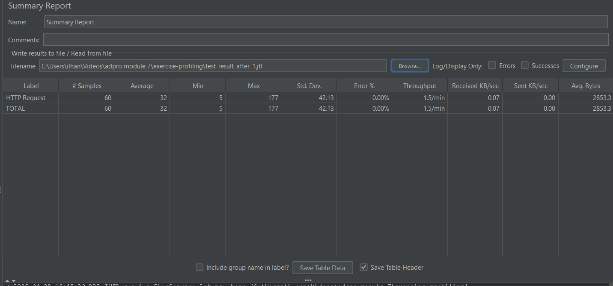
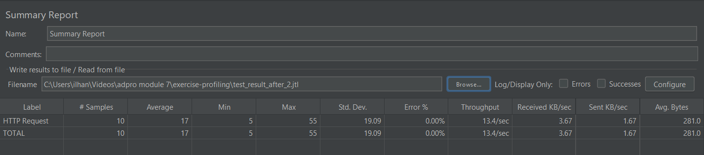
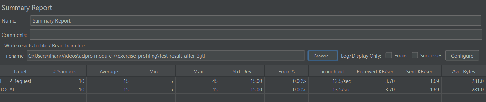

# Exercise Profiling

## Performance Testing

### Endpoint /all-student
**JMeter GUI:**

**JMeter CLI:**

### Endpoint /all-student-name
**JMeter GUI:**

**JMeter CLI:**

### Endpoint /highest-gpa
**JMeter GUI:**

**JMeter CLI:**

## Hasil Optimasi

### Perbandingan Sebelum dan Sesudah Optimasi

| Endpoint | Sebelum (Average) | Sesudah (Average) | Improvement |
|---|------|-------|-----|
| /all-student | 46ms | 32ms  | 30% |
| /all-student-name | 30ms | 17ms  | 43% |
| /highest-gpa | 34ms | 15ms  | 56% |

### Screenshot Hasil JMeter Setelah Optimasi

#### Endpoint /all-student

#### Endpoint /all-student-name

#### Endpoint /highest-gpa

### Kesimpulan
Setelah dilakukan profiling dan optimasi, terdapat peningkatan performa yang signifikan pada ketiga endpoint.
Optimasi utama yang dilakukan:
- `/all-student`: Mengganti N+1 query dengan single query menggunakan `findAll()` pada `StudentCourseRepository`
- `/highest-gpa`: Mengganti loop manual dengan query `findFirstByOrderByGpaDesc()`
- `/all-student-name`: Mengganti string concatenation dan load seluruh objek dengan query nama langsung dari DB

## Reflection

1. **What is the difference between the approach of performance testing with JMeter and
   profiling with IntelliJ Profiler in the context of optimizing application performance?**  
Performance testing dengan JMeter bersifat black-box, di mana kita mengukur perilaku aplikasi dari sudut pandang pengguna (seperti response time, throughput, dan error rate) saat berada di bawah beban tertentu. Tujuannya adalah untuk mengetahui apakah ada masalah performa. Sedangkan profiling dengan IntelliJ Profiler bersifat white-box. Ia memantau penggunaan resource (CPU, Memory, Thread) di level kode program.  
 
2. **How does the profiling process help you in identifying and understanding the weak points in your application?**  
   Profiing membantu memvisualisasikan eksekusi program, misalnya melalui Flame Graph. Dengan alat ini, saya bisa melihat metode mana yang paling banyak memakan waktu CPU. Sebagai contoh, jika sebuah metode pemanggilan database muncul berkali-kali dalam tumpukan eksekusi yang panjang, itu mengindikasikan adanya masalah efisiensi seperti N+1 query. Profiling mengubah tebakan menjadi data yang presisi mengenai bagian kode yang lambat.  
 
3. **Do you think IntelliJ Profiler is effective in assisting you to analyze and identify bottlenecks in your application code?**  
Menurut saya sangat efektif. fitur visualisasi seperti Flame Graph dan Method List mempermudah identifikasi hot spots. Selain itu, kemampuan untuk melihat alokasi memori membantu dalam mendeteksi objek-objek yang tidak perlu yang dapat memicu Garbage Collection yang berlebihan.  
 
4. **What are the main challenges you face when conducting performance testing and profiling, and how do you overcome these challenges?**  
   Tantangan utamanya adalah ketidakkonsistenan hasil karena faktor eksternal, seperti mekanisme JIT (Just-In-Time) Compiler pada JVM yang membuat hasil tes pertama seringkali lebih lambat daripada tes berikutnya (cold start). Tantangan lainnya adalah adanya error saat beban tinggi. Saya mengatasinya dengan melakukan proses warm-up (memanggil endpoint berkali-kali sebelum diukur) dan menggunakan JMeter dalam mode CLI untuk mengurangi penggunaan resource pada mesin lokal agar hasil pengukuran lebih stabil.  
 
5. **What are the main benefits you gain from using IntelliJ Profiler for profiling your application code?**  
   Manfaat utamanya adalah akurasi dalam menemukan penyebab masalah. Saya dapat melihat durasi eksekusi hingga ke level baris kode tertentu. Selain itu, profiler membantu saya memahami bagaimana Spring Data JPA berinteraksi dengan database di balik layar, sehingga saya bisa mengambil keputusan optimasi yang lebih tepat seperti penggunaan Projection atau Join Fetch.

6. **How do you handle situations where the results from profiling with IntelliJ Profiler are not entirely consistent with findings from performance testing using JMeter?**  
   Situasi ini biasanya terjadi karena perbedaan cara kerja alat (metrik internal vs eksternal). Jika terjadi ketidakkonsistenan, saya akan melakukan analisis ulang pada data percentile (seperti P90 atau P95) di JMeter, bukan hanya rata-rata. Saya juga akan memastikan bahwa beban yang diberikan saat profiling setara dengan beban saat testing JMeter untuk memastikan kedua alat tersebut mengamati kondisi sistem yang sama.  
 
7. **What strategies do you implement in optimizing application code after analyzing results from performance testing and profiling? How do you ensure the changes you make do not affect the application's functionality?**  
   Strategi yang saya gunakan meliputi berikut: Memperbaiki query database untuk menghindari N+1 issues. Menggunakan Projection untuk menghindari pengambilan data yang tidak diperlukan (seperti membatasi kolom).  Memindahkan logika komputasi berat dari aplikasi ke query database (misalnya penggunaan fungsi agregasi). Untuk memastikan fungsionalitas tetap terjaga, saya menjalankan kembali unit test dan memastikan response yang diberikan oleh endpoint (melalui browser atau Postman) tetap memberikan data yang benar dan konsisten dengan hasil sebelum optimasi.